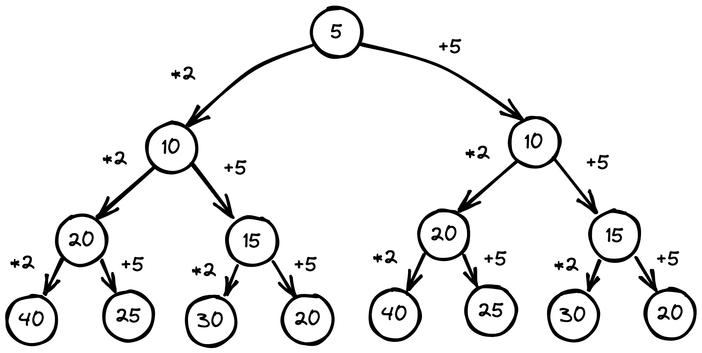

# Конфетки
### Решение
Важно осознать, что нам дан алгоритм, в котором каждое последующее решение опирается на предыдущее. А количество пальцев означает, сколько раз мы должны эти действия повторить - в нашем случае 3.

Для каждого N мы имеем два исхода: N * A, N + B. Несложно посчитать, что количество всех исходов будет равно 2^3 = 8.

Теперь давайте поймем, что это за числа А и В в описании алгоритма. Нам даны все исходы применения алгоритма к N=11. Наименьшему исходу соответсвует последовательность действий N+A+A+A=N+3A, а наибольшему N*A*A*A=N*A^3. Соответсвенно возьмем из известных исходов минимальное и максимальное числа - 26 и 88.

```
11+3A=26  -> A=5
11*A^3=88 -> A=2
```

Далее изобразим решения при помощи дерева.


**Ответ: [20; 25; 30; 40]**
<div class="page" />
### Программное решение на F#

```F#
let rec candiesOutcomes a b fingersLeft (n: int) =
    seq {
        if fingersLeft = 0 then n
        else
            yield! candiesOutcomes a b (fingersLeft - 1) (n * a)
            yield! candiesOutcomes a b (fingersLeft - 1) (n + b)
    }

let a, b, n, fingersLeft = 2, 5, 5, 3

n |> candiesOutcomes a b fingersLeft
  |> Seq.distinct
  |> Seq.sort
  |> printfn "Possible outcomes: %A"
```

```
Input: a=2; b=5, n=5, fingersLeft=3
Output: [20;25;30;40]
```
