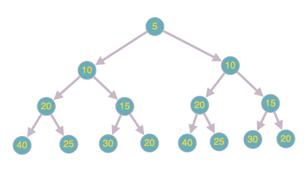

# Конфетки

Для начала поймем, что количество возможных исходов 2^3 = 8. В условии задачи как раз представлено 8 исходов. Они нужны нам, чтобы понять, какие числа представляют собой А и B в алгоритме. Возьмем минимальный и максимальный исходы - 26 и 88. Очевидно, что минимальный получается путем добавления B конфет в вазу 3 раза, а максимальный - путем увеличения конфет в А раз 3 раза.

Получаем:

* 11 * A^3 = 88 => A^3 = 8 => **A = 2**
* 11 + 3 * B = 26 => 3 * B = 15 => **B = 5**

**Ответ: [20; 25; 30; 40]**

