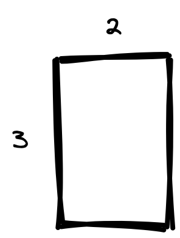
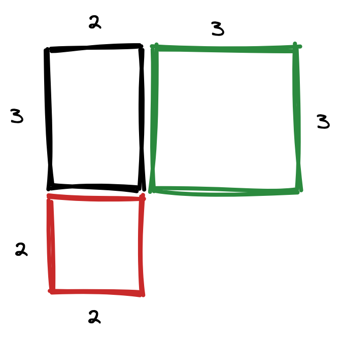
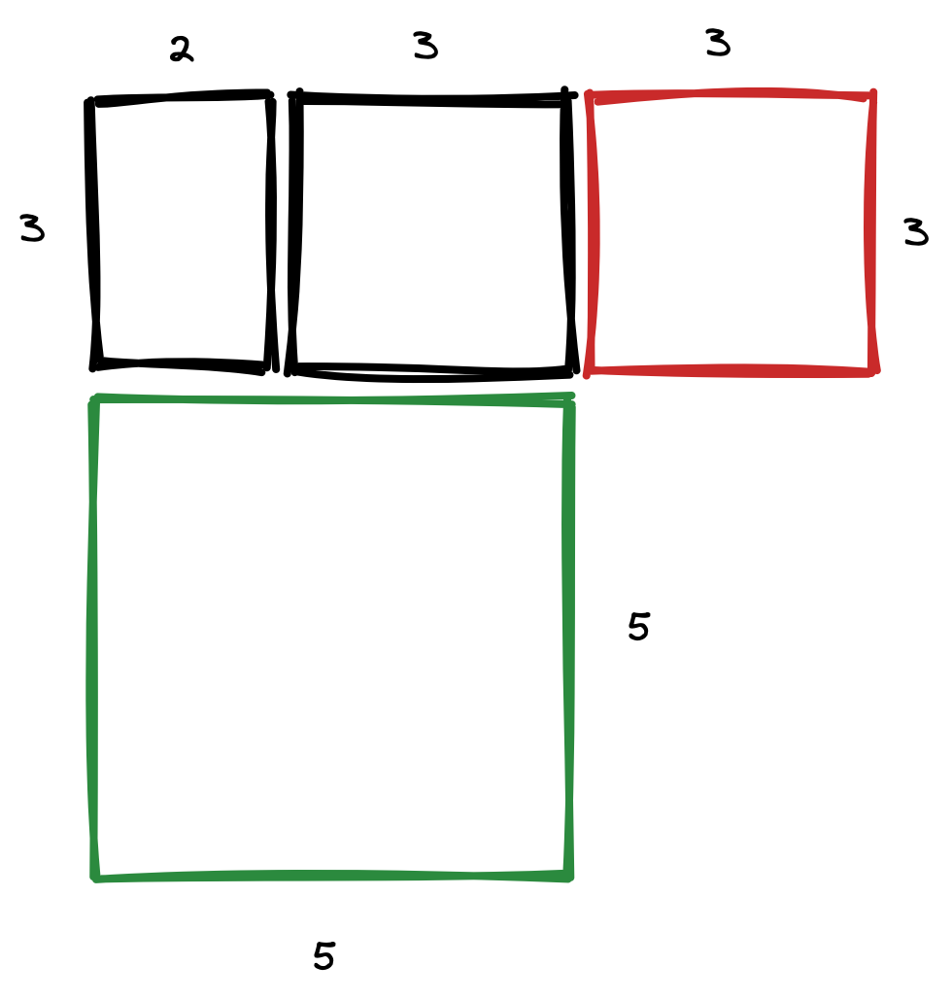
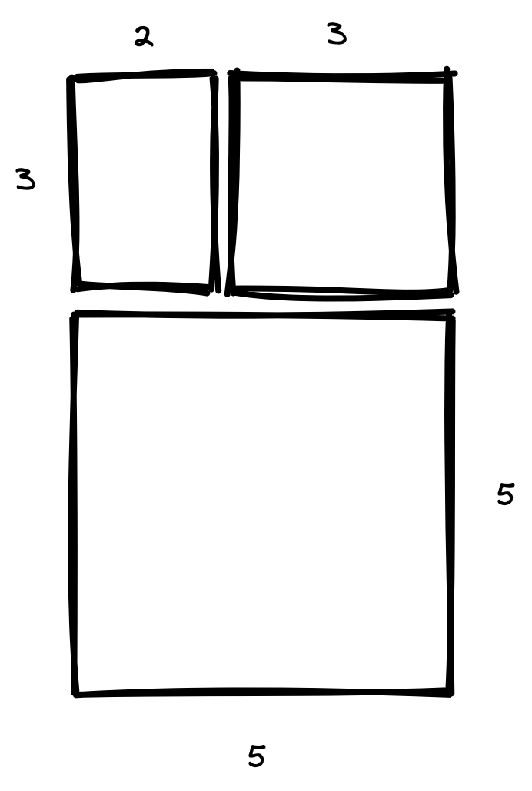

# Отрезали квадрат

Начнем с получившегося прямоугольника размером *2×3*.

Мы знаем, что изначально был большой прямоугольник, а из него уже вырезали квадрат наибольший площади, а наш исходный прямоугольник - его оставшаяся часть. Получить такой прямоугольник мы можем двумя способами: достроив квадрат со стороной 2 (красный) или достроив квадрат со стороной 3 (зеленый). Очевидно, какой из них обладает большей площадью - его и выберем.

Далее повторяем аналогичный алгоритм для получившегося прямоугольника. Из двух квадратов выбираем со стороной 5.

В итоге получим следующий прямоугольник со сторонами *8×5* и площадью *40*

**Ответ: 40**