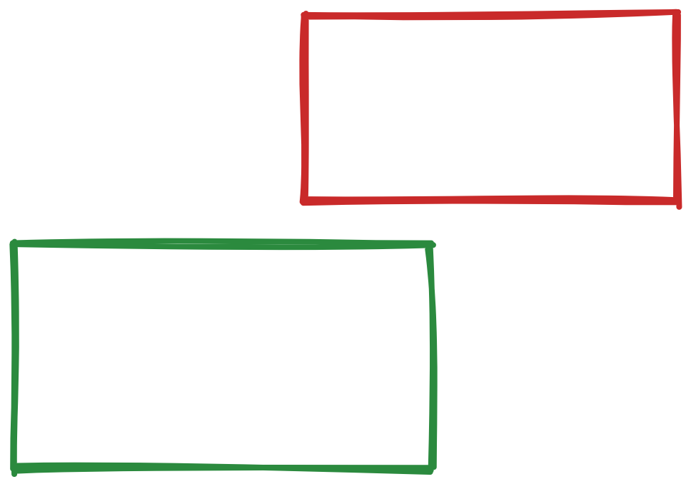
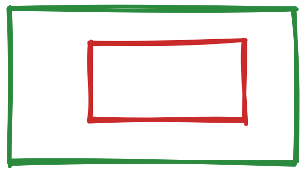
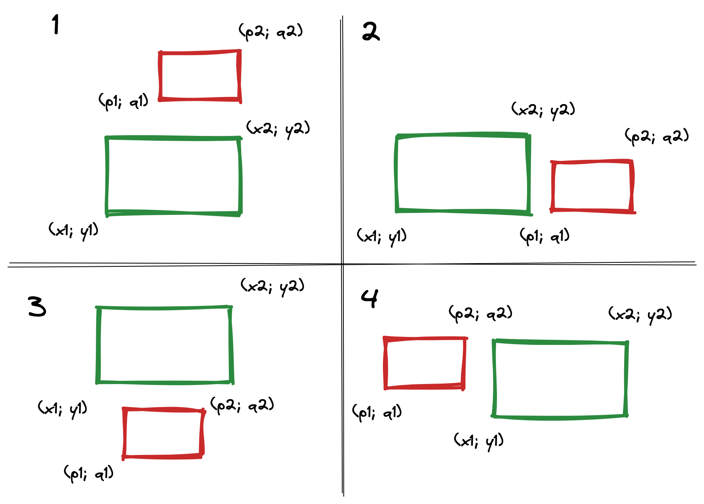
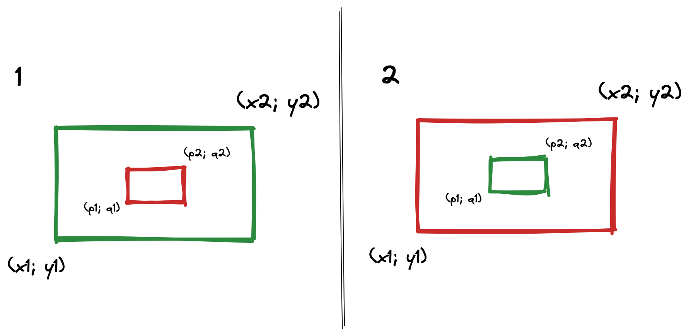

# Пересекающие прямоугольники
Наша задача - определить пересекаются ли два прямоугольника. Но мы пойдем обратным путем: будем определять, что они не пересекаются, а затем сделаем отрицание результата. Стоит уточнить, что мы знаем координаты левого нижнего и правого верхнего углов.

Разобъем задачу на подзадачи. Всего у нас имеется два случая непересечения:
* Прямоугольник лежит вне границ другого прямоугольника.
 
* Прямоугольник содержит другой прямоугольник.


<div class="page" />

### Прямоугольник вне границ
Когда прямоугольник лежит вне границ, нам достаточно рассмотреть всего 4 случая: сверху, справа, снизу, слева. Определяется это легко: например, 1 случай задается условием **q1 > y2**, 2 - **p1 > x2** и т.д. Назовем сравнением сопоставление двух компонент разных координат. Тогда, чтобы проверить лежит ли прямоугольник вне границ, нам понадобится ровно **4 сравнения**.


<div class="page" />

### Содержит другой прямоугольник
В предыдущих случаях было неважно, какой прямоугольник мы брали за основной. Здесь же иная ситуация: необходимо выбрать базовый прямоугольник как точку отсчета. Обозначим базовый прямоугольник зеленым цветом, а проверяемый - красным. Тогда существует два случая:
* Основной содержит проверяемый
* Проверяемый содержит основной

Чтобы узнать, что один прямоугольник содержит другой понадобится **4 сравнения**. Однако мы не можем гарантировать, что за основной был взят внешний прямоугольник, поэтому если первая проверка не сработала, необходимо поменять местами основной и проверяемый и сделать еще **4 сравнения**. По итогу в худшем раскладе получаем **8 сравнений**.


### Результат
Итак, если мы сразу определим, что прямоугольник находится вне границ, то
**минимальный результат - *4 сравнения***.

Если это сделать не удалось, то **максимальный результат - *12 сравнений.***

<div class="page" />

### Программное решение на C#
Т.к. я не могу. приложить исходники на портале, добавлю их здесь.

```CSharp
internal record Point
{
    public double X { get; init; }
    public double Y { get; init; }
}

internal record Rectangle
{
    public Point BottomLeft { get; init; } = null!;
    public Point TopRight { get; init; } = null!;

    public bool Intersects(Rectangle other)
    {
        return Overlaps(other) && !(Contains(other) || other.Contains(this));
    }

    public bool Overlaps(Rectangle other)
    {
        var (x1, y1, x2, y2) = this;
        var (p1, q1, p2, q2) = other;

        return !(q1 > y2 || p1 > x2 || y1 > q2 || x1 > p2);
    }

    public bool Contains(Rectangle other)
    {
        var (x1, y1, x2, y2) = this;
        var (p1, q1, p2, q2) = other;

        return p1 >= x1 && x2 >= p2 && q1 >= y1 && y2 >= q2;
    }

    public void Deconstruct(
        out double x1,
        out double y1,
        out double x2,
        out double y2)
    {
        x1 = BottomLeft.X;
        y1 = BottomLeft.Y;
        x2 = TopRight.X;
        y2 = TopRight.Y;
    }
}
```