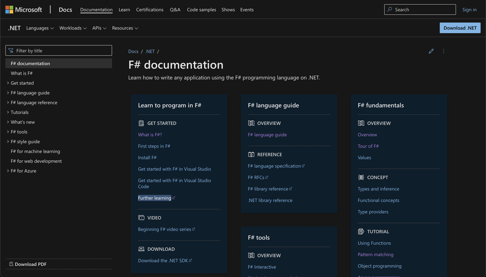

## F# как лекарство от наболевшего ООП. Каралюс Никита

### Почему F#?
Спустя пару лет разработки в классическом ООП стиле приходит понимание, что системы, которые мы проектируем, излишне переусложнены. Напиши unit-тест на функцию сложения, реализуй 1000 служебных интерфейсов, выучи паттерны, выбери библиотеку, выбери фреймворк, выбери жизнь.

Но неужели нельзя проще? Оказывается, решение есть – функциональное программирование. Конечно, серебряных пуль не существует, но за это мы теперь платим простой, а не очередным слоем абстракции. Более того, все лучше практики в ООП берут свое начало в ФП.

В качестве первого функционального языка многие выбирают F#: он поддержан Microsoft, работает поверх платформы .NET, полностью совместим с C#, позволяет использовать все его библиотеки. Интересная тенденция наблюдается в скандинавских странах, где компании массово начинают переходить с C# на F#.

Поэтому неплохо было бы найти ресурс, где рассказывают про язык и парадигму не столько с точки зрения новичка, сколько опытного человека, желающего сменить технологию. 

### Критерии оценки
Для подбора такого ресурса необходимо учитывать следующие критерии:
1)	Понимание авторами предметной области
2)	Структурированность
3)	Удобство чтения
4)	Практические примеры
5)  Актуальность
6)	Возможность обсуждения, обратной связи
7)	Оформление

## [MSDN](https://docs.microsoft.com/en-gb/dotnet/fsharp/)

### О ресурсе
Официальная документация Microsoft - первое место, куда пойдет любой .NET разработчик, чтобы получить ответы на свои вопросы. Здесь рассказывается о всех возможностях F#, статьи обновляются вместе с языком, сделана удобная навигация, имеется русская версия. Также можно найти ссылки на другие источники и небольшие туториалы. Весомый минус при работе с MSDN -  отсутствие консистентности. Где-то будут хорошие практические примеры, где-то нет, где-то просто перечислены сигнатуры функций, стиль кода отличается от статьи к статье. Все дело в том, что документация ведется и Microsoft, и энтузиастами. Кроме того, обратная связь достаточно затруднена, а обсуждение отсутствует.

### Оценка
1)	Понимание авторами предметной области: ***4/5***
2)	Структурированность: ***5/5***
3)	Практические примеры: ***3/5***
4)	Удобство чтения: ***2/5***
5)  Актуальность: ***5/5***
6)	Возможность обсуждения, обратной связи: ***1/5***
7)	Оформление: ***4/5***

## [F# for Fun and Profit](https://fsharpforfunandprofit.com)

### О ресурсе
Блог Скотта Влащина о функциональном программировании на F#. Автор - один из главных популяризаторов данной парадигмы, а его статьи, книги и выступления достойны отдельной категории в этой области. Лендинг сразу заявляет, что данный ресурс для разработчиков с опытом. Скотт в своих текстах в превосходной манере рассказывает о функциональном дизайне и приводит понятные практические примеры. Также автор активно проводит параллели между C# и F#, что еще лучше позволяет понять тему. После каждой статьи на сайте имеется обсуждение, где можно пообщаться не только с другими читателями, но и с самим автором. К сожалению, в последнее время статьи практически перестали выходить и обновляться: последняя датируются 2021 годом.

### Оценка
1)	Понимание авторами предметной области: ***5/5***
2)	Структурированность: ***5/5***
3)	Практические примеры: ***5/5***
4)	Удобство чтения: ***5/5***
5)  Актуальность: ***3/5***
6)	Возможность обсуждения, обратной связи: ***5/5***
7)	Оформление: ***5/5***

## [Metanit](https://metanit.com/f/tutorial/)

### О ресурсе
Главный русскоязычный ресурс о программировании. Обычно им пользуются, чтобы быстро вспомнить какую-либо конструкцию языка. Материал описывается понятным языком в формате небольших статей, после каждой - обсуждение. Ресурс ведется одним автором, поэтому стиль кода на протяжении статей сохраняется. И это одна из его главных проблем: Metanit пытается покрыть множество языков, в основном из ООП мира, из-за чего страдает понимание концепций ФП. Так, например, в разделе по F# огромный блок посвящен его ООП возможностям. Примеры чересчур абстрактные, нужны только для демонстрации синтаксиса.

### Оценка
1)	Понимание авторами предметной области: ***2/5***
2)	Структурированность: ***4/5***
3)	Практические примеры: ***2/5***
4)	Удобство чтения: ***4/5***
5)  Актуальность: ***4/5***
6)	Возможность обсуждения, обратной связи: ***5/5***
7)	Оформление: ***3/5***

## Заключение
Абсолютных величин в нашем мире не существует, поэтому и сказать, что используем одно, а к другому не прикасаемся, нельзя. Поэтому предлагаю сформулировать в каких ситуациях ресурс стоить использовать, а в каких лучше посмотреть в другую сторону.

| Ресурс                | Стоить использовать                                          | Не стоить использовать                                 |
| --------------------- | ------------------------------------------------------------ | ------------------------------------------------------ |
| MSDN                  | Вспомнить синтаксис; узнать базовые концепции, интеграцию с фреймворками и библиотеками | Углубить свои знания в  ФП; узнать о хороших практиках |
| F# for Fun and Profit | Обрести функциональные мышление, стиль кода; найти практические примеры | Быстро вспомнить информацию                            |
| Metanit               | Проблемы с английским языком, молниеносно вспомнить синтаксис | Углубить свои знания в  ФП; узнать о стиле кода        |

